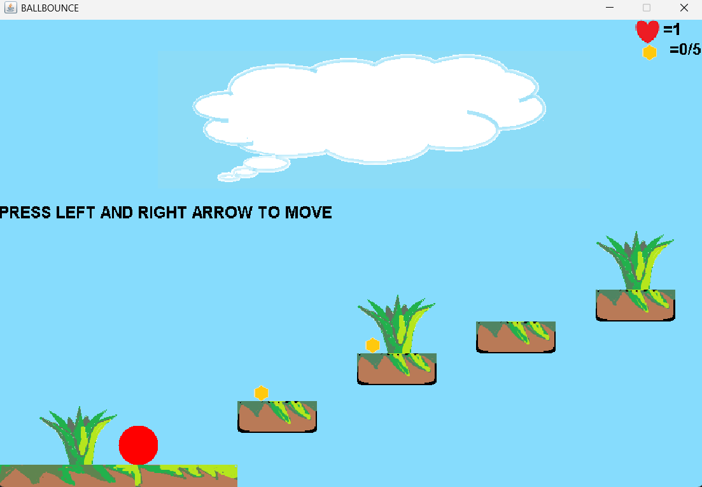

# Bounce Ball Clone (Java)

A small 2D platformer I created while learning Java in Class 9.

This was my first mini-game project and was heavily inspired by the classic Nokia game **Bounce**. The original source code has mostly been lost over time, but I was able to recover and decompile the executable, which is preserved in this repository.

## About the Project

This game was built as a learning project during my early programming journey. At the time, I was experimenting with:

* Java game development
* Basic physics and collision detection
* Keyboard input handling
* Level design concepts
* Object-oriented programming

Although the code reflects my beginner experience, it represents an important milestone in my learning process.

## Features

* Side-scrolling/platform-style gameplay
* Ball movement and jumping mechanics
* Obstacle collision detection
* Simple level progression
* Inspired by the classic Nokia Bounce experience

## Technologies Used

* Java
* Java AWT/Swing (if applicable)
* Basic 2D graphics rendering
  
## Screenshots

### Gameplay

### Level 1

## Why I'm Sharing This

This project is a snapshot of where I started as a programmer. Looking back at it years later is a reminder of how much can be learned from small experiments and hobby projects.

Every developer has a first game, first app, or first messy codebase—this one was mine.

## License

This project is shared for archival and educational purposes.
